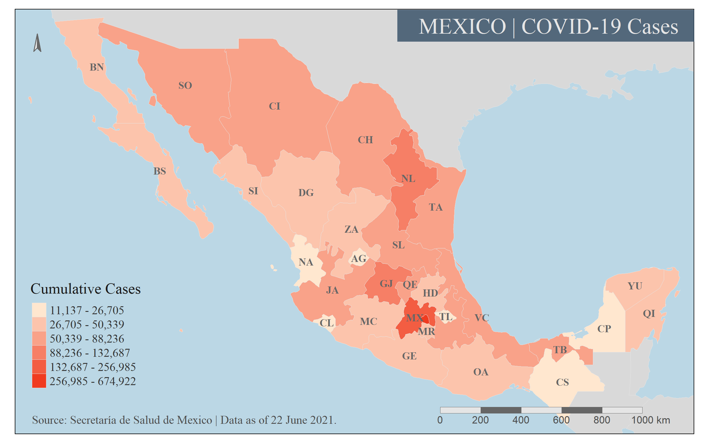

# Elegant Cartography with tmap

As someone who works at the intersection of geospatial data science and public health, I have often encountered situations in which different parties come to the table with different technological fluencies. While proprietary and open-source GIS programs are the go-to for many GIS analysts and technologists, those in the public health domain are more accustomed to using R or SAS to undertake their analysis. 

To better serve our public health requestors, I thought it was essential for our geospatial-oriented group to deepen our understanding of how R could be used to undertake spatial analysis and produce high-quality maps. This particular demo served to demonstrate how to create a choropleth map using R for a group of GIS analysts who wanted to learn more about using R as an alternative to proprietary GIS platforms. A major focus of the code was specifying arguments to create a sophisiticated looking static map of publishable quality. I also stressed the importance of using JSON and GeoJSON files for geometry rather than the more cumbersome and less flexible shapefile format. The package of choice for the mapping is tmap.

